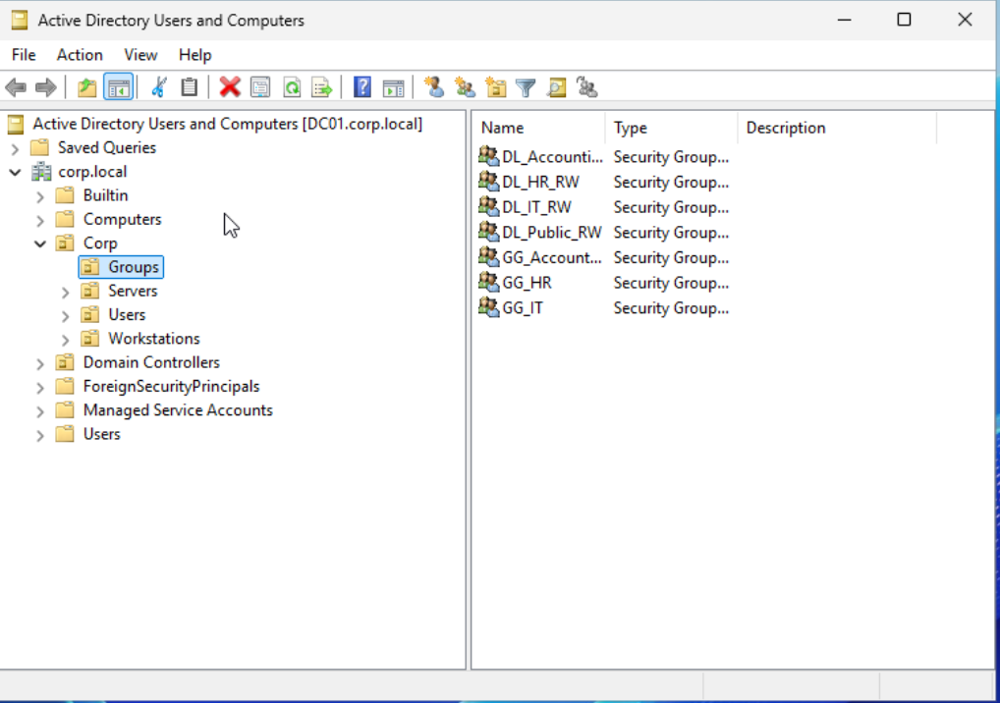

# Phase 2 — OU & Group Design

## Objective
Design enterprise-style AD structure using AGDLP model.

## OU Structure

corp.local  
└── Corp  
  ├── Users  
  ├── Workstations  
  ├── Servers  
  └── Groups  

*Figure 1 — Organizational Unit structure inside corp.local.*

---

## Global Groups (Role-Based)
- GG_IT
- GG_Accounting
- GG_HR

*Figure 2 — Global and Domain Local security groups.*

---

## Domain Local Groups (Resource-Based)
- DL_IT_RW
- DL_Accounting_RW
- DL_HR_RW
- DL_Public_RW

## Nesting Model (AGDLP)
Users → Global Group → Domain Local Group → NTFS Permission

## AGDLP Example – IT Department

User: ivan.it  
Member of: GG_IT (Global)  
GG_IT is nested into: DL_IT_RW (Domain Local)  
DL_IT_RW is assigned NTFS Modify permission on: D:\Shares\IT  

Access is granted through group nesting, not direct user permission.

*Figure 2 — Global and Domain Local security groups.*

## Lessons Learned
- OUs are different from containers
- Advanced Features needed to manage deletion protection
- Domain Local groups are used for resource permissions
- Never assign NTFS permissions directly to users
