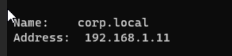
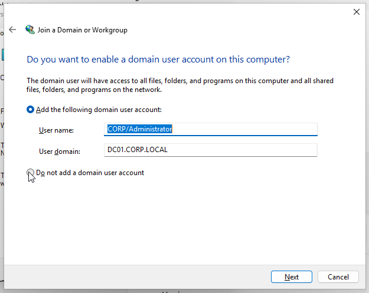
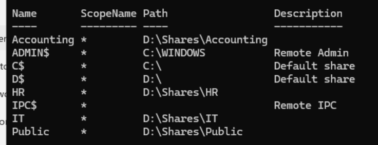
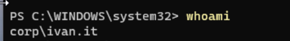
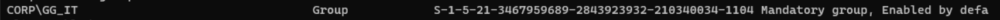
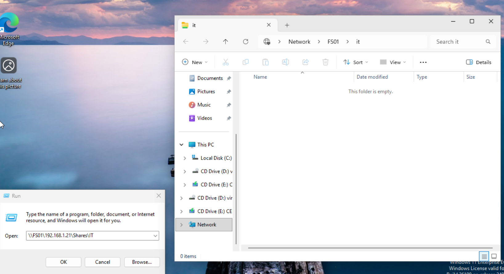

# Phase 3 — File Server Shares + NTFS Permissions Validation

## Objective
Validate end-to-end access control using:
- AD groups (AGDLP)
- SMB share permissions
- NTFS permissions
- Real client login/token behavior (CL01)

## Environment
- DC01 (Domain Controller): 192.168.1.11 (DNS)
- FS01 (File Server): 192.168.1.21
- CL01 (Client): DHCP on 192.168.1.0/24
- Domain: corp.local

## Pre-Join Client DNS Check (CL01)
CL01 must use DC01 for DNS before joining the domain.

- DNS set to: 192.168.1.11
- Validation: `nslookup corp.local` resolves to 192.168.1.11

## Domain Join (CL01)
CL01 joined to the domain:
- Domain: `corp.local`
- Credentials used: `CORP\Administrator`

## Share + Folder Structure (FS01)
Data disk:
- `D:\Shares\`

Folders:
- `D:\Shares\IT`
- `D:\Shares\Accounting`
- `D:\Shares\HR`
- `D:\Shares\Public`

## SMB Shares (FS01)
SMB shares created and pointed to the correct paths.

## NTFS Permission Model (AGDLP)
We use AGDLP:
- Accounts → Global Groups → Domain Local Groups → Permissions

Example chain (IT):
- `ivan.it` ∈ `GG_IT`
- `GG_IT` ∈ `DL_IT_RW`
- `DL_IT_RW` has NTFS Modify on `D:\Shares\IT`
- Share permission allows access for `DL_IT_RW`

## Client Token Validation (CL01)
Logged in as:
- `corp\ivan.it`

Validation commands:
- `whoami`
- `whoami /groups`

## Access Tests (CL01)

### IT Share (Expected: ALLOW)
Test:
- `\\FS01\IT`

Result:
- ✅ Access granted

### Accounting Share (Expected: DENY)
Test:
- `\\FS01\Accounting`

Result:
- ❌ Access denied (expected)

## Troubleshooting Notes (What went wrong + fix)
Initial issue:
- Folders existed but were not accessible from the network.

Root cause:
- SMB shares were not created (only default ADMIN$, C$, D$, IPC$ existed).

Fix:
- Create SMB shares for each department folder and ensure each share points to the correct folder path.

Additional issue encountered:
- The `IT` share was accidentally pointed at `D:\Shares` (parent folder) instead of `D:\Shares\IT`.
- Fixed by removing the incorrect share and recreating it with the correct path.

## Key Concepts Learned
- AD access depends on DNS. Clients must use the DC as DNS to find domain services.
- Access is the intersection of SMB share permissions and NTFS permissions.
- Group membership is captured in the user’s logon token; changes may require re-logon to update the token.
- AGDLP keeps permissions scalable and avoids assigning rights directly to users.

## Result
End-to-end validation succeeded:
- Correct user allowed to access the correct share
- Incorrect user denied access to unauthorized share
