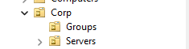
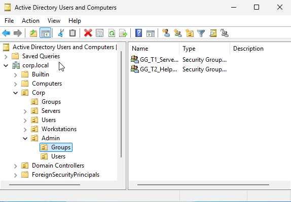
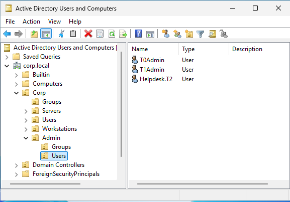

# Phase 4 – Tier Model Hardening

## Objective

Align the Hybrid Identity Lab with Microsoft’s Administrative Tier Model
to enforce credential boundaries and reduce lateral movement risk.

This phase formalizes privilege separation before introducing:
- Azure AD Connect
- Enterprise workstation management
- Hybrid identity expansion

Identity is treated as the root of trust.

---

## Background

Through Phase 3.1 (Kerberos & Identity Flow), the environment
successfully demonstrated authentication mechanics.

However, administrative tooling and credential placement were not
explicitly tier-separated.

Risks identified:

- Potential privilege crossover between servers and identity systems
- Administrative groups mixed with resource groups
- Lack of defined logon scope boundaries

This phase corrects that architectural gap.

---

## Tier Model Implementation

### Tier 0 – Identity

**Systems**
- DC01 (Domain Controller)

**Account**
- CORP\T0Admin

**Group Membership**
- Domain Admins

**Scope**
- Manage Active Directory
- Manage Domain Controllers
- Identity authority only

**Security Boundary**
- Tier 0 credentials must never log into Tier 1 or Tier 2 systems.
- No general-purpose usage (email, browsing, workstation login).

---

### Tier 1 – Servers

**Systems**
- FS01 (File Server)
- Future member servers

**Security Group**
- GG_T1_Server_Admins

**Account**
- CORP\T1Admin

**Scope**
- Local administrator on Tier 1 systems
- No Domain Admin privileges
- No DC logon rights

**Security Boundary**
- Tier 1 does not control identity.
- Tier 1 credentials never access DCs.

---

### Tier 2 – Workstations

**Systems**
- CL01
- Future domain-joined clients

**Security Group**
- GG_T2_Helpdesk

**Account**
- CORP\HelpdeskT2

**Scope**
- Manage workstation configuration
- Reset standard user passwords (delegated later)
- No server or DC privileges

**Security Boundary**
- Tier 2 credentials cannot access servers or domain controllers.

---

## OU Design Enforcement

Administrative identities are isolated:

Corp
└── Admin
├── Users
└── Groups

---Separation ensures:

- Clean GPO scoping
- Security filtering capability
- Clear privilege auditing
- Reduced blast radius

---Resource groups remain in:

**Corp\Groups**

Administrative groups are not mixed with business role groups.

---

## Security Rationale

The Tier Model exists to:

- Prevent credential theft escalation
- Contain compromise impact
- Protect authentication authority
- Enforce identity as a security boundary

This prepares the lab for:

- Privileged Access Workstation (PAW)
- Logon restriction policies
- Azure AD Connect (Tier 0 classification)

---

## Validation

The following controls were validated:

- Tier admin accounts created and isolated
- Administrative groups separated from resource groups
- OU structure refactored to support enforcement
- Screenshots captured as architectural evidence

---

## Evidence

---

## Next Phase

- Remove AD administrative tools from Tier 1 systems
- Implement logon restrictions
- Introduce Privileged Access Workstation (PAW)
