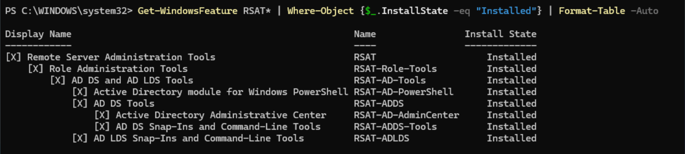
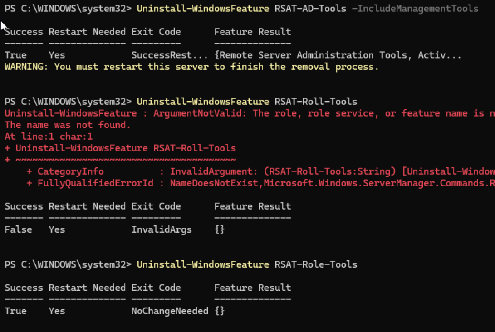

# Phase 4.1 – Tier 1 Tooling Removal (FS01)

## Objective

Remove Active Directory administrative tooling from the Tier 1 server (FS01) 
to enforce Microsoft Tier Model separation and reduce identity attack surface.

---

## System

- FS01 (Domain Member Server)
- Classified as Tier 1 (Server Tier)

---

## Background

During earlier lab phases, Remote Server Administration Tools (RSAT)
for Active Directory were installed on FS01.

This created a privilege crossover risk:

- Tier 1 system capable of administering Tier 0 identity
- Increased lateral movement potential
- Expanded credential theft blast radius

Tier 1 systems must not manage identity.

---

## Current State (Before Change)

The following features were installed:

- RSAT-AD-Tools
- RSAT-AD-PowerShell
- RSAT-ADDS
- RSAT-Role-Tools

---

## Change Implemented

Removed Active Directory administrative tooling from FS01.

### Commands Executed

```powershell
Uninstall-WindowsFeature RSAT-AD-Tools -IncludeManagementTools
Uninstall-WindowsFeature RSAT-Role-Tools
```


## Evidence






