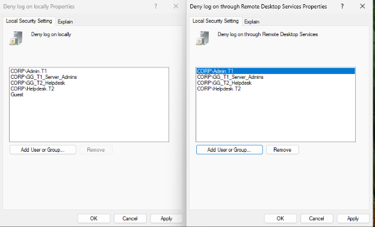
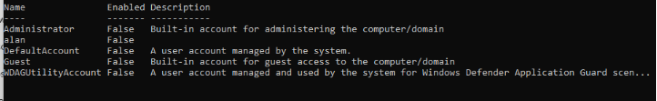

# Phase 4.2 – PAW01 Deployment and Initial Hardening

## Objective
Deploy a Tier 0 Privileged Access Workstation (PAW01) and enforce strict credential boundary controls.

---

## System
- Hostname: PAW01
- OS: Windows 11 Enterprise
- Network: DHCP (192.168.1.x)
- Domain: corp.local
- Joined using: CORP\Admin.T0

---

## Boundary Controls Implemented

### 1. Tier Enforcement (Local Security Policy)

Configured the following User Rights Assignments on PAW01:

#### Deny log on locally:
- CORP\Admin.T1
- CORP\GG_T1_Server_Admins
- CORP\GG_T2_Helpdesk
- CORP\Helpdesk.T2
- Guest

#### Deny log on through Remote Desktop Services:
- CORP\Admin.T1
- CORP\GG_T1_Server_Admins
- CORP\GG_T2_Helpdesk
- CORP\Helpdesk.T2

Result:
Tier 1 and Tier 2 accounts and groups are explicitly blocked from accessing the Tier 0 workstation.

This prevents credential crossover and enforces strict tier isolation.

---

### 2. Local Account Hardening

Verified and enforced local account posture:

- Administrator — Disabled
- alan — Disabled
- Guest — Disabled
- DefaultAccount — System managed
- WDAGUtilityAccount — System managed

Result:
No local interactive login paths remain available.
All access must occur through Tier 0 domain credentials.

---

## Validation

- Domain join successful.
- Login tested with CORP\Admin.T0.
- Tier 1 profile removed.
- Local accounts verified disabled.

---

## Security Impact

PAW01 is now a controlled Tier 0 asset.

- No Tier 1 credential crossover.
- No local admin fallback.
- Reduced lateral movement surface.
- Identity management isolated to Tier 0.

## Evidence

### Deny Logon Policies

### Local User Status

