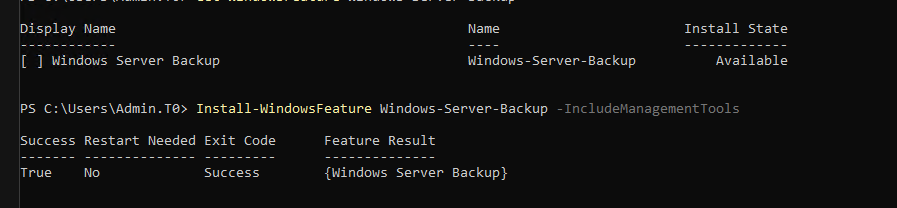
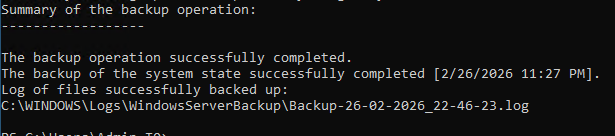
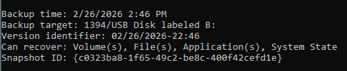
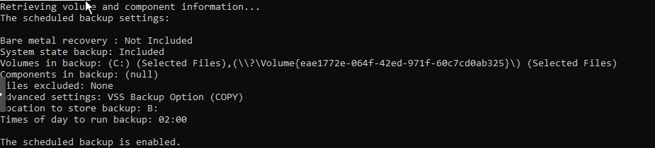

## 5.1 FSMO Role Verification

### CLI Verification

Command executed:

netdom query fsmo

Result:

- Schema master: DC01.corp.local
- Domain naming master: DC01.corp.local
- PDC: DC01.corp.local
- RID pool manager: DC01.corp.local
- Infrastructure master: DC01.corp.local

#### Evidence


---

### GUI Verification – Domain Roles

Verified via:
Active Directory Users and Computers  
corp.local → Right-click → Operations Masters

Tabs validated:
- RID
- PDC
- Infrastructure

Each confirmed: DC01.corp.local

#### Evidence


---

### GUI Verification – Forest Role

Verified via:
Active Directory Domains and Trusts  
Right-click → Operations Master

Confirmed:
Domain Naming Master → DC01.corp.local

#### Evidence


---

### Summary

All FSMO roles are held by DC01 as expected in a single-domain-controller lab environment.

DC01 currently functions as:
- Forest authority
- Domain authority
- RID allocator
- Time authority (PDC Emulator)
- Authentication authority


## 5.2 Domain Controller Health Validation

Domain controller operational health was validated using built-in diagnostic tools.

---

### Advertising Test

Command:
dcdiag /s:DC01 /test:Advertising

Result:
DC01 passed test Advertising.

Validated:
- DC advertising as Domain Controller
- LDAP server
- Key Distribution Center (KDC)
- Global Catalog
- Time server

---

### Services Test

Command:
dcdiag /s:DC01 /test:Services

Result:
DC01 passed test Services.

Validated:
- NTDS service
- DNS service
- Netlogon
- RPC

---

### Full Diagnostic

Command:
dcdiag /s:DC01 /v

Result:
All critical tests passed including:
- Connectivity
- Advertising
- NetLogons
- SysVolCheck
- MachineAccount
- NCSecDesc
- Replications

---

### Replication Status

Command:
repadmin /replsummary

Result:
Single-DC environment.
No replication partners.
No replication failures.

---

### KCC Validation

Command:
dcdiag /s:DC01 /test:KccEvent

Result:
DC01 passed test KccEvent.

Conclusion:
Replication topology engine operating normally.

---

### Evidence
passed test Advertising
passed test FrsEvent
passed test DFSREvent
passed test SysVolCheck
passed test MachineAccount
passed test NCSecDesc
passed test NetLogons
passed test Replications


# 05.3 – Domain Controller System State Backup

## 🎯 Objective

Implement, validate, and automate **System State backups** for `DC01` to ensure Active Directory recoverability and domain integrity.

---

## 🖥 Environment

| Component     | Value                |
|--------------|----------------------|
| Server       | DC01                 |
| Role         | Domain Controller    |
| Backup Target| Dedicated 20GB VHD   |
| Drive Letter | B:                   |
| Volume Label | DC01-Backup          |
| Backup Scope | System State         |

---

## 1️⃣ Install Windows Server Backup

Install the Windows Server Backup feature:

```powershell
Install-WindowsFeature Windows-Server-Backup -IncludeManagementTools
```

### Validation

```powershell
Get-WindowsFeature Windows-Server-Backup
```

**Expected Result:**  
`Installed = True`

---

## 2️⃣ Validate Backup Disk

Confirm the dedicated backup disk is present and healthy:

```powershell
Get-Volume
```

**Expected Output:**

- DriveLetter: `B`
- FileSystem: `NTFS`
- HealthStatus: `Healthy`
- FileSystemLabel: `DC01-Backup`

---

## 3️⃣ Perform Manual System State Backup (Validation Test)

Execute a one-time backup to validate functionality prior to scheduling:

```powershell
wbadmin start systemstatebackup -backupTarget:B: -quiet
```

**Expected Result:**  
`The backup operation successfully completed.`

### This validates:

- Volume Shadow Copy Service (VSS)
- NTDS database snapshot
- SYSVOL backup
- Registry backup
- Boot configuration data (BCD)

---

## 4️⃣ Validate Backup Version

Confirm that a backup version exists:

```powershell
wbadmin get versions
```

**Expected Output:**

- Backup time
- Backup target: `B:`
- Version identifier
- Recoverable items: `System State`

---

## 5️⃣ Configure Scheduled Daily Backup

Enable automated daily System State backup at **02:00 AM**:

```powershell
wbadmin enable backup `
-addtarget:B: `
-systemstate `
-schedule:02:00 `
-quiet
```

This creates a scheduled task under:

```
Task Scheduler → Microsoft → Windows → Backup
```

---

## 6️⃣ Validate Scheduled Configuration

Confirm scheduled backup settings:

```powershell
wbadmin get configuration
```

**Expected Output:**

- System State backup: Included
- Backup location: `B:`
- Scheduled time: `02:00`
- Scheduled backup: Enabled

---

## 🔐 Recovery Capability

This configuration supports:

- Non-authoritative restore
- Authoritative restore (future lab section)
- NTDS database recovery
- SYSVOL recovery
- Registry recovery

---

## 📌 Operational Notes

- Backup disk is dedicated exclusively to `DC01`.
- Manual backup validation performed prior to scheduling.
- Daily automated System State backups are enabled.
- Configuration verified using `wbadmin`.

---

## ✅ Status

**DC01 System State backup successfully implemented, validated, and scheduled.**


## Validation

### 1. Windows Server Backup Installation

Confirmed Windows Server Backup feature installed successfully.



---

### 2. Backup Disk Detection

Confirmed dedicated 20GB backup disk (B:) is present and healthy.


---

### 3. Manual System State Backup Success

Validated successful manual System State backup.



---

### 4. Backup Version Confirmation

Confirmed backup version identifier exists and System State is recoverable.



---

### 5. Scheduled Backup Configuration

Confirmed daily System State backup scheduled at 02:00.


