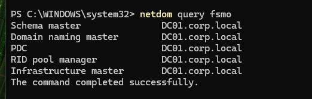
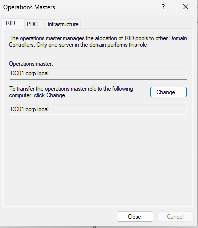
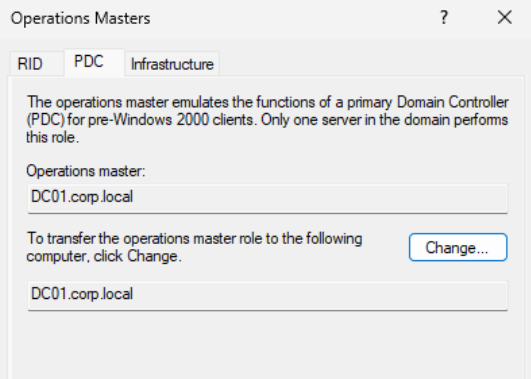
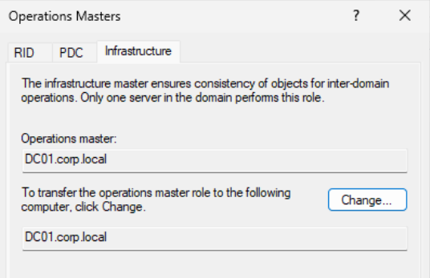
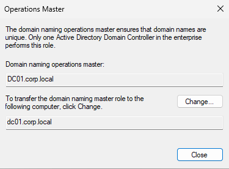
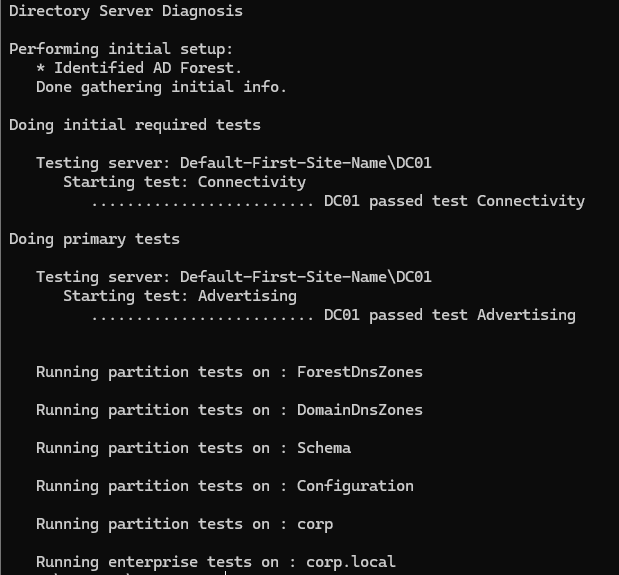
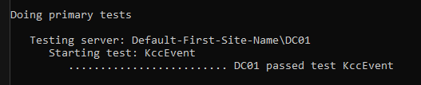
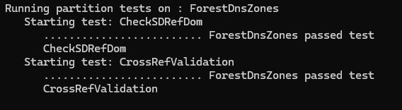
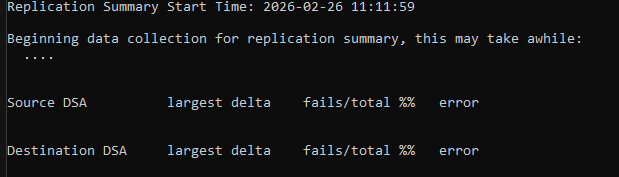

## 5.1 FSMO Role Verification

### CLI Verification

Command executed:

netdom query fsmo

Result:

- Schema master: DC01.corp.local
- Domain naming master: DC01.corp.local
- PDC: DC01.corp.local
- RID pool manager: DC01.corp.local
- Infrastructure master: DC01.corp.local

#### Evidence

---

### GUI Verification – Domain Roles

Verified via:
Active Directory Users and Computers  
corp.local → Right-click → Operations Masters

Tabs validated:
- RID
- PDC
- Infrastructure

Each confirmed: DC01.corp.local

#### Evidence

---

### GUI Verification – Forest Role

Verified via:
Active Directory Domains and Trusts  
Right-click → Operations Master

Confirmed:
Domain Naming Master → DC01.corp.local

#### Evidence

---

### Summary

All FSMO roles are held by DC01 as expected in a single-domain-controller lab environment.

DC01 currently functions as:
- Forest authority
- Domain authority
- RID allocator
- Time authority (PDC Emulator)
- Authentication authority

## 5.2 Domain Controller Health Validation

Domain controller operational health was validated using built-in diagnostic tools.

---

### Advertising Test

Command:
dcdiag /s:DC01 /test:Advertising

Result:
DC01 passed test Advertising.

Validated:
- DC advertising as Domain Controller
- LDAP server
- Key Distribution Center (KDC)
- Global Catalog
- Time server

---

### Services Test

Command:
dcdiag /s:DC01 /test:Services

Result:
DC01 passed test Services.

Validated:
- NTDS service
- DNS service
- Netlogon
- RPC

---

### Full Diagnostic

Command:
dcdiag /s:DC01 /v

Result:
All critical tests passed including:
- Connectivity
- Advertising
- NetLogons
- SysVolCheck
- MachineAccount
- NCSecDesc
- Replications

---

### Replication Status

Command:
repadmin /replsummary

Result:
Single-DC environment.
No replication partners.
No replication failures.

---

### KCC Validation

Command:
dcdiag /s:DC01 /test:KccEvent

Result:
DC01 passed test KccEvent.

Conclusion:
Replication topology engine operating normally.

---

### Evidence
passed test Advertising
passed test FrsEvent
passed test DFSREvent
passed test SysVolCheck
passed test MachineAccount
passed test NCSecDesc
passed test NetLogons
passed test Replications

