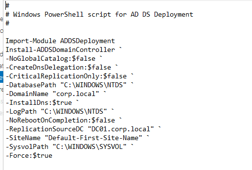
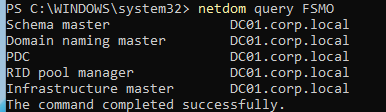
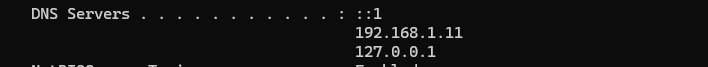
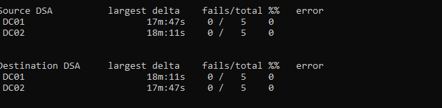
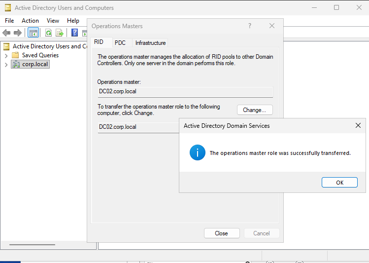
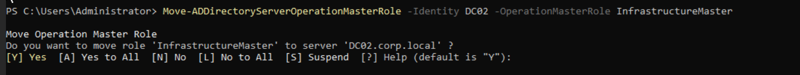
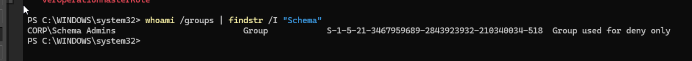
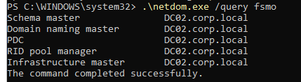

# 05.1 – DC02 Build and FSMO Transfer

## Objective

Deploy a secondary domain controller (DC02), validate multi-master replication, and perform a controlled FSMO role transfer from DC01 to DC02.

This phase establishes directory redundancy, operational role mobility, and time hierarchy alignment.

---

# Phase 1 – DC02 Deployment

## Build Configuration

- OS: Windows Server (Desktop Experience)
- Static IP: 192.168.1.12
- DNS (initial): 192.168.1.11 (DC01)
- Joined domain using Tier 0 account
- Installed AD DS role
- Promoted as Additional Domain Controller
- DNS role installed
- Global Catalog enabled

---

# Phase 2 – Replication Validation

## Initial Replication Failure

Error observed:

```
8524 – The DSA operation is unable to proceed because of a DNS lookup failure.
```

### Root Cause

DC02 DNS configuration included:

- ::1
- 127.0.0.1
- 192.168.1.11

DC02 attempted to resolve replication partners using itself before DNS records and SRV entries were fully stable.

### Resolution

Temporarily reconfigured DC02 DNS to:

```
192.168.1.11
```

Executed:

```
ipconfig /flushdns
ipconfig /registerdns
Restart-Service netlogon
repadmin /syncall /AdeP
```

Replication returned to healthy state.

## Validation

```
repadmin /replsummary
0 failures
```

Multi-master replication confirmed operational.

---

# Phase 3 – FSMO Role Transfer

FSMO roles were transferred only after replication validation.

## Transfer Order

1. RID Master
2. PDC Emulator
3. Infrastructure Master
4. Domain Naming Master
5. Schema Master

Schema transfer required:

- Membership in **Schema Admins**
- Elevated PowerShell session (UAC token filtering enforced)

---

## FSMO State Before Transfer

```
netdom query fsmo

Schema Master            → DC01
Domain Naming Master     → DC01
RID Master               → DC01
PDC Emulator             → DC01
Infrastructure Master    → DC01
```

---

## FSMO State After Transfer

```
netdom query fsmo

Schema Master            → DC02
Domain Naming Master     → DC02
RID Master               → DC02
PDC Emulator             → DC02
Infrastructure Master    → DC02
```

DC02 now holds all operational roles.

---

# Phase 4 – Time Hierarchy Realignment

After moving the PDC Emulator role, domain time authority was corrected.

On DC02 (PDC Emulator):

```
w32tm /config /manualpeerlist:"0.pool.ntp.org,1.pool.ntp.org" /syncfromflags:manual /reliable:yes /update
net stop w32time
net start w32time
w32tm /resync
```

Verification:

```
w32tm /query /status
Source: External NTP
```

On DC01:

```
w32tm /query /status
Source: DC02.corp.local
```

Time hierarchy aligned with PDC Emulator.

---

# Architecture Outcome

- Multi-master Active Directory topology established
- DNS replication stabilized
- FSMO roles migrated cleanly (no seizure)
- Time authority aligned correctly
- Replication healthy (0 failures)

---

# Key Lessons

- DNS misconfiguration can silently break AD replication.
- New domain controllers should not use themselves as primary DNS until replication stabilizes.
- Schema Admin privileges require elevation due to UAC token filtering.
- FSMO transfers must only occur after replication validation.
- Domain time hierarchy is a Kerberos security boundary.

---

# Status

DC02 is authoritative domain controller.
Domain operating in healthy dual-DC configuration.

---

# Screenshot Evidence

## DC02 Promotion Script (GUI-Generated PowerShell)



---

## Initial FSMO State (All Roles on DC01)



---

## Replication Failure – Error 8524 (DNS Lookup Failure)


---

## DC02 DNS Misconfiguration (Loopback Present)



---

## Replication Healthy After DNS Correction



---

## FSMO Transfer – RID Role (GUI Confirmation)




## FSMO Transfer via PowerShell (Infrastructure Master Example)

The Infrastructure Master role was transferred using PowerShell:

```powershell
Move-ADDirectoryServerOperationMasterRole `
-Identity DC02 `
-OperationMasterRole InfrastructureMaster
```

Confirmation prompt:



This demonstrates command-line role transfer capability in addition to GUI-based transfer.


---

## Schema Admin Token (Deny Only – Not Elevated)



---

## Final FSMO State (All Roles on DC02)



---
