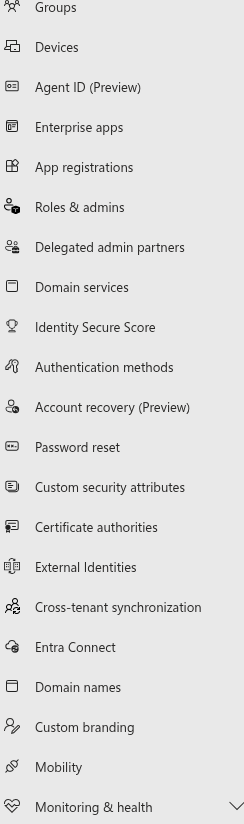
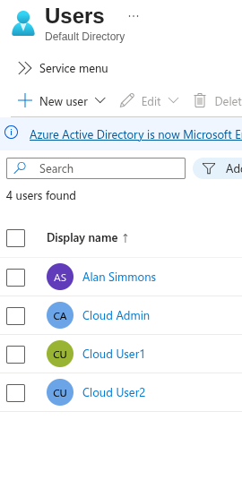
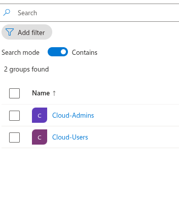
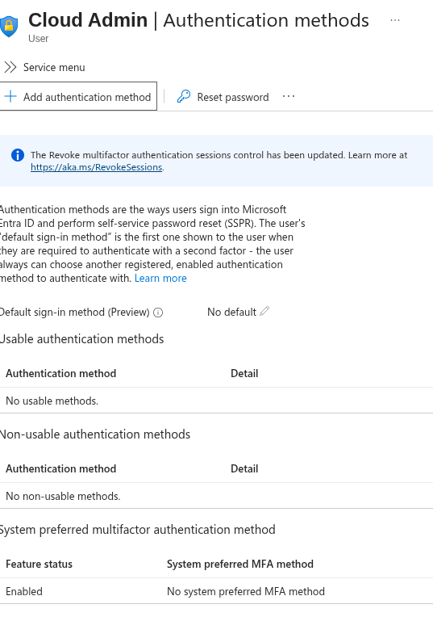
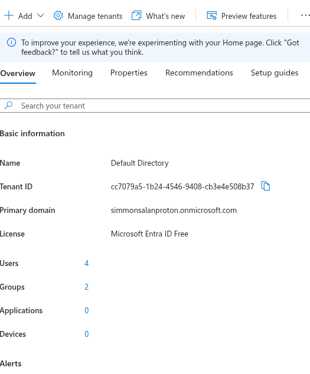

# Phase 8.1 — Microsoft Entra ID Tenant Setup

## Overview

This lab extends the on-prem Active Directory environment into a cloud identity provider using Microsoft Entra ID.

The Entra tenant will act as the **Identity Provider (IdP)** for cloud authentication and later integrate with the on-prem domain using Entra Connect.

Lab Environment

On-Prem Environment

- DC01 (Domain Controller)
- DC02 (Domain Controller)
- FS01 (File Server)
- CL01 (Client Workstation)
- Domain: `corp.local`

Cloud Identity Environment

- Microsoft Entra ID Tenant
- Domain: `simmonsalanproton.onmicrosoft.com`

---

# Identity Architecture
Active Directory (corp.local)
│
│ Entra Connect (later phase)
│
Microsoft Entra ID
│
├ Users
├ Groups
└ Enterprise Applications (SSO)

The Entra tenant acts as the **central authentication authority** for cloud applications.

---

# Step 1 — Tenant Creation

A Microsoft Entra tenant was created through the Azure sign-up process.

Tenant Overview

- Tenant Name: Default Directory
- Primary Domain: `simmonsalanproton.onmicrosoft.com`
- License: Microsoft Entra ID Free

Screenshot:

---

# Step 2 — Create Cloud Identities

Three cloud identities were created for testing authentication and authorization.

Users

- `admin@simmonsalanproton.onmicrosoft.com`
- `cloud-admin@simmonsalanproton.onmicrosoft.com`
- `cloud-user1@simmonsalanproton.onmicrosoft.com`
- `cloud-user2@simmonsalanproton.onmicrosoft.com`

Screenshot:

---

# Step 3 — Create Security Groups

Two security groups were created to demonstrate Role Based Access Control (RBAC).

Groups

- Cloud-Admins
- Cloud-Users

Assignments

Cloud-Admins
- cloud-admin

Cloud-Users
- cloud-user1
- cloud-user2

Screenshot:

---

# Step 4 — Authentication Methods

Authentication methods define how a user proves their identity to Entra.

Initially the users only authenticate with a password.

Future phases will configure:

- Microsoft Authenticator
- MFA
- Passwordless authentication
- FIDO2 security keys

Screenshot:

---

# Step 5 — Identity Provider Confirmation

The Entra tenant now acts as the **Identity Provider (IdP)** for the environment.

Authentication Flow

User
↓
Application
↓
Redirect to Microsoft Entra ID
↓
User Authentication
↓
Token Issued
↓
Application Access Granted

This architecture enables:

- Single Sign-On (SSO)
- Centralized authentication
- Conditional access policies
- Identity monitoring

---

# Current Tenant State

Users: 4  
Groups: 2  
Applications: 0  
Devices: 0

Screenshot:

---

# Next Phase

Next lab:

**Phase 8.2 — Entra Connect (Hybrid Identity Synchronization)**

Objectives:

- Install Entra Connect
- Synchronize `corp.local` users
- Create hybrid identities
- Verify synchronization in Entra ID

Example Hybrid Identity

alan@corp.local
↓
Synced via Entra Connect
↓
alan@simmonsalanproton.onmicrosoft.com

This enables hybrid authentication between **Active Directory and Microsoft Entra ID**.

