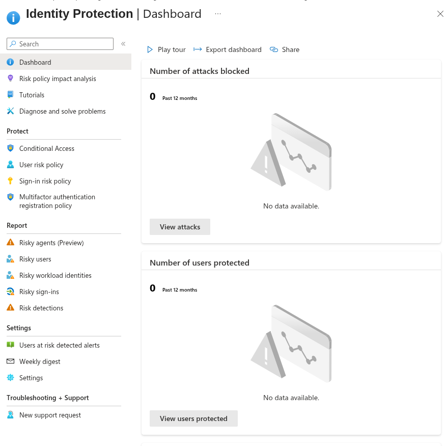
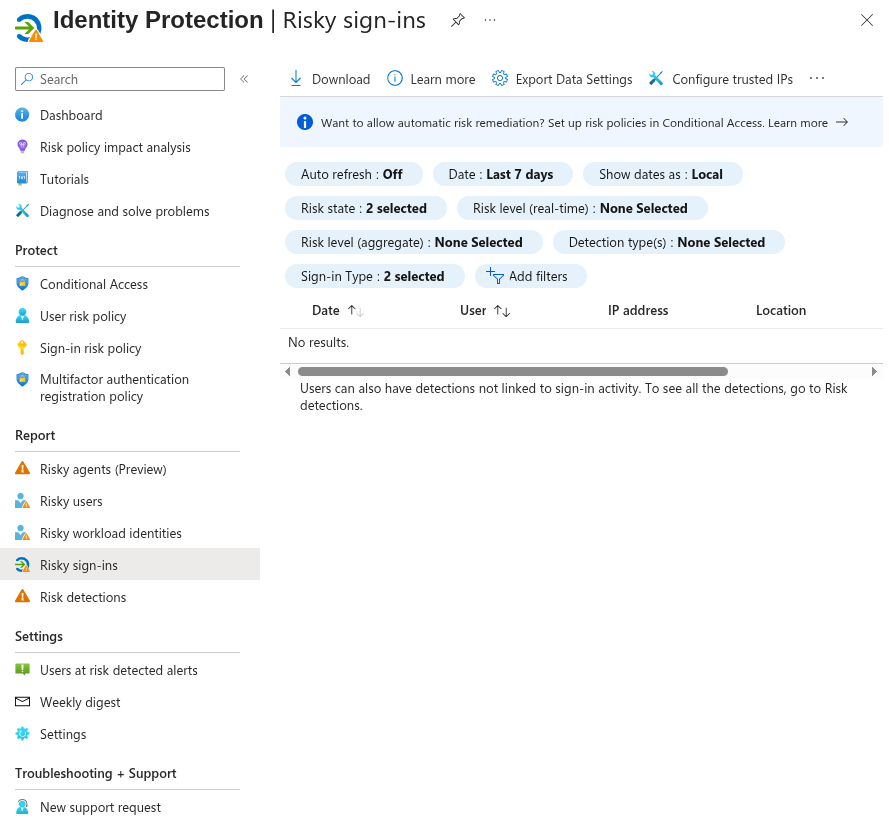
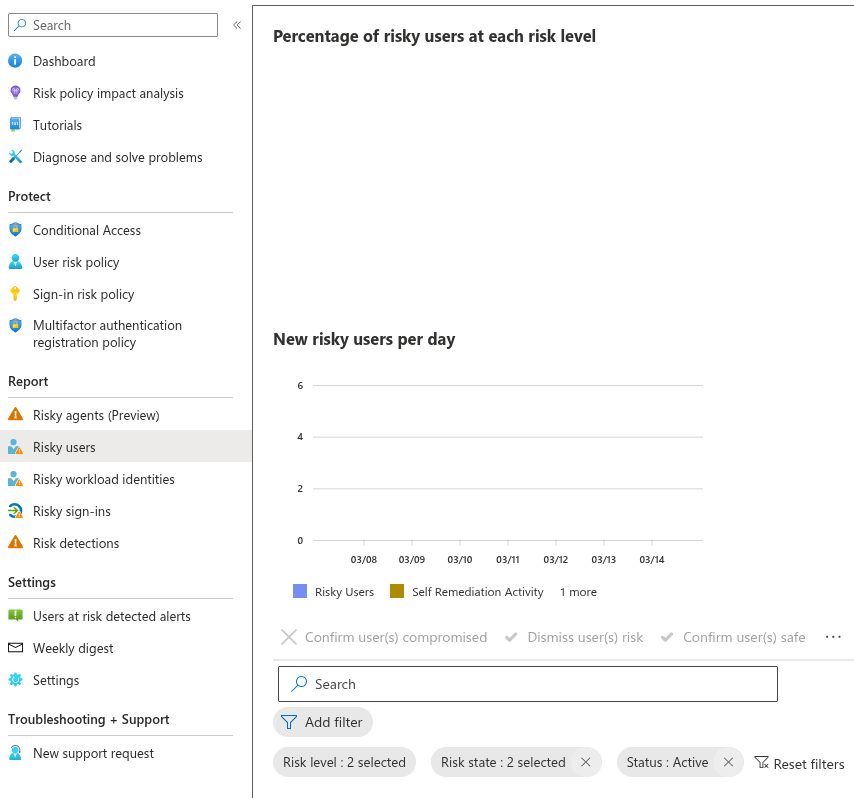

# 08.6 — Microsoft Entra Identity Protection

## Objective

Explore Microsoft Entra Identity Protection and understand how the platform detects and responds to identity-based threats such as:

- Impossible travel
- Anonymous proxy logins
- Malware-linked IP addresses
- Leaked credentials
- Suspicious sign-in activity

Identity Protection is a core component of **Zero Trust security** in Microsoft Entra.

---

# Environment

Tenant:

simmonslab.onmicrosoft.com

Identity platform:

Microsoft Entra ID

Security features used:

- Conditional Access
- Multi-Factor Authentication (MFA)
- Privileged Identity Management (PIM)
- Identity Protection

---

# Step 1 — Open Identity Protection

Navigate to:

Microsoft Entra ID
↓
Protection
↓
Identity Protection

This dashboard provides visibility into identity-related security risks detected across the tenant.

---

# Identity Protection Dashboard

The dashboard provides metrics such as:

- Number of attacks blocked
- Number of protected users
- Risk activity trends

These insights help security teams identify identity-based threats.

## Screenshot

---

# Step 2 — Review Risky Sign-ins

Navigate to:

Identity Protection
↓
Risky sign-ins

This view shows authentication attempts that Microsoft has flagged as potentially malicious.

Risk signals may include:

- Impossible travel
- Suspicious IP addresses
- Malware-linked infrastructure
- Anonymous proxy usage

## Screenshot

---

# Step 3 — Review Risky Users

Navigate to:

Identity Protection
↓
Risky users

A **risky user** indicates that Microsoft Entra has detected behavior suggesting that the user's credentials may be compromised.

Risk can be triggered by:

- Credential leaks
- Suspicious login activity
- Unusual behavior patterns

## Screenshot

---

# How Identity Protection Works

Microsoft analyzes authentication signals globally and evaluates sign-ins using machine learning.

Example scenario:

User logs in from Ohio
↓
10 minutes later login from Europe
↓
Impossible travel detected
↓
Sign-in risk = HIGH
↓
Conditional Access forces MFA or blocks login

This provides **automated threat detection and response** for identity-based attacks.

---

# Security Value

Identity Protection helps defend against:

- Credential stuffing attacks
- Password spray attacks
- Phishing-based account compromise
- Malicious login infrastructure
- Stolen credentials

These controls are a fundamental part of **Zero Trust identity security**.

---

# Phase Progress

Completed:

08.1 Tenant Setup
08.2 Users & Groups
08.3 Enterprise Application
08.4 Conditional Access (Admin MFA)
08.5 Privileged Identity Management
08.6 Identity Protection

---

# Next Phase

08.7 Risk-Based Conditional Access Policies

Examples:

- Block high-risk sign-ins
- Force password reset for risky users
- Require MFA for risky sessions
