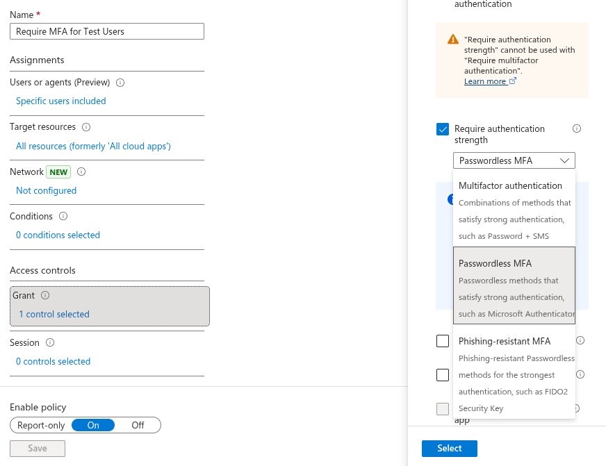
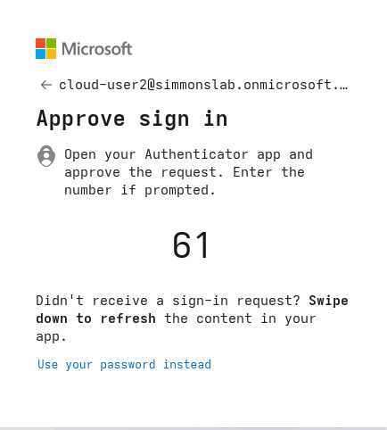

# 08.12 — Authentication Methods

## Objective

Configure and test modern authentication methods in Microsoft Entra ID.

This phase focused on enabling and validating Microsoft Authenticator as a sign-in method, including passwordless sign-in capability.

---

## Overview

Authentication methods define **what users are allowed to use** when proving their identity.

In this lab, Microsoft Authenticator was enabled and registered for a test user. After registration, the user was able to complete sign-in using the Microsoft Authenticator app.

This phase also highlighted an important distinction in Entra ID:

- **Authentication methods** determine what sign-in methods are available
- **Conditional Access** determines what sign-in methods are required

---

## Why This Matters

Modern authentication strengthens identity security by moving away from password-only sign-in.

Microsoft Authenticator provides:

- MFA using push notifications
- number matching for stronger verification
- passwordless sign-in capability
- reduced reliance on passwords as the primary authentication factor

This supports Zero Trust principles by improving confidence in the user’s identity during sign-in.

---

## Authentication Method Policy

The following methods were enabled in the authentication methods policy:

- Microsoft Authenticator
- Temporary Access Pass
- Software OATH tokens
- Email OTP

For this phase, the primary focus was Microsoft Authenticator.

Screenshot:

---

## User Registration

A test user registered Microsoft Authenticator as a sign-in method.

After setup, the account showed:

- Microsoft Authenticator as the default sign-in method
- device registration completed successfully

Screenshot:

---

🔐 Passwordless Enforcement (Conditional Access)
🎯 Objective

Transition from configured authentication methods to enforced passwordless authentication using Conditional Access.

🔧 Configuration

Updated Conditional Access policy:

Require MFA for Test Users

Grant:

Require authentication strength → Passwordless MFA

Authentication methods restricted:

✅ Microsoft Authenticator (Passwordless enabled)

❌ Email OTP (disabled)

❌ Software OATH (disabled)

❌ Temporary Access Pass (disabled)

🧪 Testing

User sign-in flow:

Username entered
↓
Password entered (optional step)
↓
Forced into Microsoft Authenticator
↓
Number matching + biometric verification required
📸 Screenshots

🧠 Key Learning
Enabling passwordless authentication is not sufficient on its own.
Conditional Access must enforce authentication strength to ensure
that passwords cannot satisfy authentication requirements.
🔥 Real-World Insight
Even when passwordless authentication is enforced, the password prompt
may still appear in the login interface. However, it cannot be used to
complete authentication, effectively eliminating passwords as a valid method.
