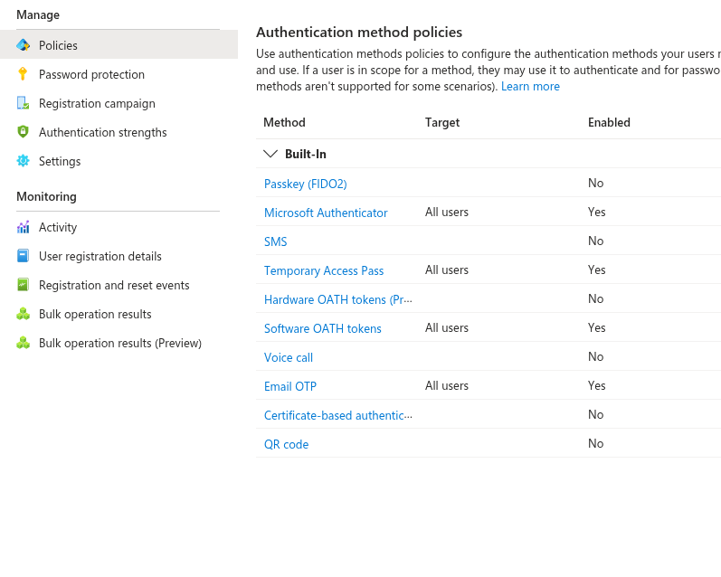
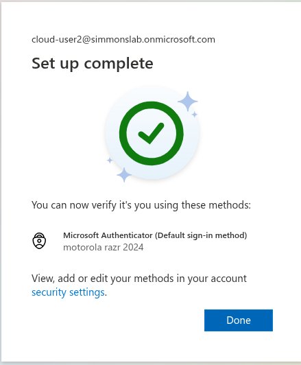
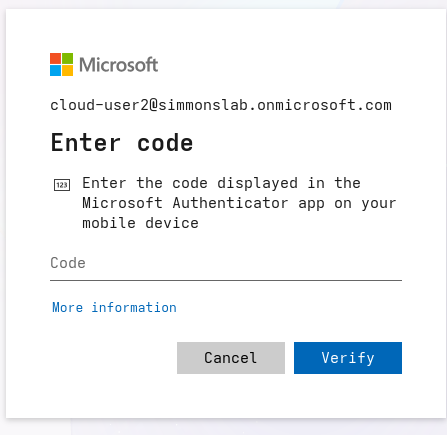

# 08.12 — Authentication Methods

## Objective

Configure and test modern authentication methods in Microsoft Entra ID.

This phase focused on enabling and validating Microsoft Authenticator as a sign-in method, including passwordless sign-in capability.

---

## Overview

Authentication methods define **what users are allowed to use** when proving their identity.

In this lab, Microsoft Authenticator was enabled and registered for a test user. After registration, the user was able to complete sign-in using the Microsoft Authenticator app.

This phase also highlighted an important distinction in Entra ID:

- **Authentication methods** determine what sign-in methods are available
- **Conditional Access** determines what sign-in methods are required

---

## Why This Matters

Modern authentication strengthens identity security by moving away from password-only sign-in.

Microsoft Authenticator provides:

- MFA using push notifications
- number matching for stronger verification
- passwordless sign-in capability
- reduced reliance on passwords as the primary authentication factor

This supports Zero Trust principles by improving confidence in the user’s identity during sign-in.

---

## Authentication Method Policy

The following methods were enabled in the authentication methods policy:

- Microsoft Authenticator
- Temporary Access Pass
- Software OATH tokens
- Email OTP

For this phase, the primary focus was Microsoft Authenticator.

Screenshot:



---

## User Registration

A test user registered Microsoft Authenticator as a sign-in method.

After setup, the account showed:

- Microsoft Authenticator as the default sign-in method
- device registration completed successfully

Screenshot:



---

## Passwordless Sign-In Test

After enabling phone sign-in in the Microsoft Authenticator app, the user was able to choose the app-based sign-in path.

During sign-in, Entra prompted for a verification code displayed in the Authenticator app.

Screenshot:



This demonstrated that passwordless sign-in was available as an authentication option.

---

## Key Learning

This phase clarified an important security concept:

```text
Enabled does not mean enforced

Even though passwordless sign-in was available, the user could still choose traditional password-based sign-in unless stronger enforcement was configured through Conditional Access.

That means this phase established:

-method availability
-user registration
-passwordless capability

But not yet:

-passwordless-only enforcement
-blocking weaker sign-in paths
-Security Value

This lab demonstrates:

--Modern authentication method configuration
--Microsoft Authenticator registration
--Passwordless sign-in capability
--Reduced dependence on passwords
--Stronger user verification through app-based sign-in
--Architecture Summary

The working flow for this phase was:

User account
        ↓
Microsoft Authenticator enabled
        ↓
User registers Authenticator app
        ↓
Passwordless sign-in option becomes available
        ↓
User can verify identity with the app
Design Insight

This phase also reinforced the difference between:

--Authentication Methods
--What users can use
--Conditional Access
--What users must use

That distinction matters because organizations often enable strong methods first, then later enforce them through policy once adoption is complete.
