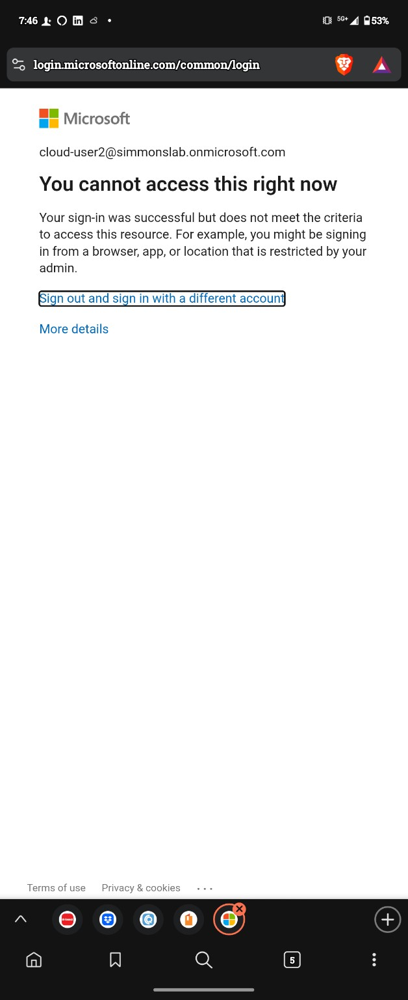
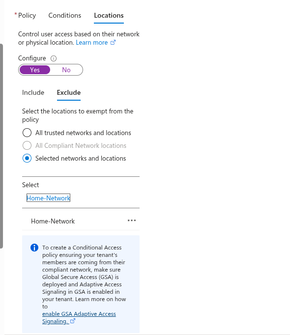
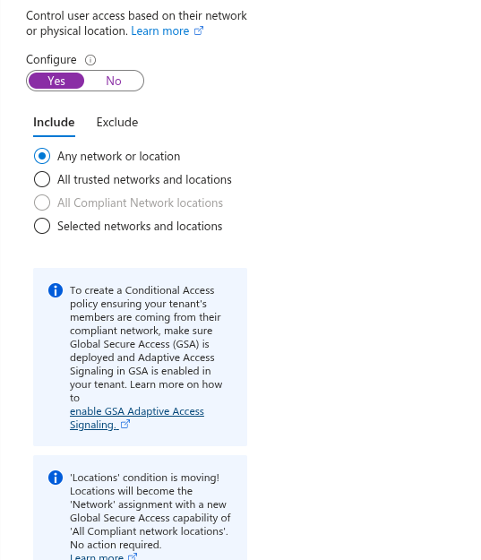
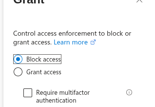
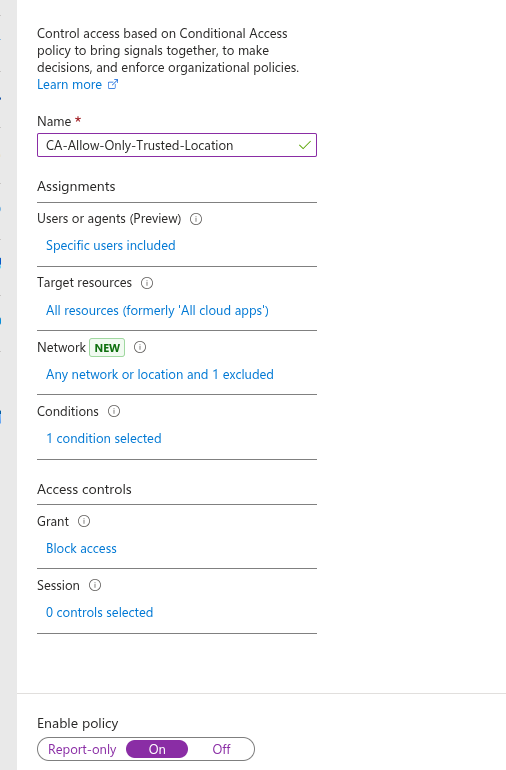
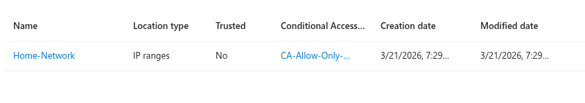

## 🧱 Phase 08.14 — Location-Based Conditional Access (Block Outside Trusted Network)

### 🎯 Objective
Enforce Zero Trust by restricting access to a trusted network location using Conditional Access.

---

### 🔧 Configuration

#### Named Location

- Name: Home-Network
- Type: IP range
- IP: (your public IP /32)
- Marked as trusted

---

#### Conditional Access Policy

- Name: CA-Allow-Only-Trusted-Location
- Users: CloudUser2
- Target: All cloud apps

---

#### Conditions — Locations

- Configure: Yes

- Include:
  - Any network or location

- Exclude:
  - Selected locations → Home-Network

---

#### Grant Controls

- Block access

---

#### Policy State

- Enabled

---

### 🧪 Testing

#### ✅ Trusted Network (Home WiFi)

- Login successful
- Policy not applied (excluded location)

---

#### ❌ Untrusted Network (Cellular Data)

- Authentication successful
- Access blocked

---

### 🔍 Sign-in Flow (Untrusted Location)

Username entered
↓
Authentication successful
↓
Conditional Access policy evaluated
↓
Location not trusted
↓
Block access triggered
↓
User denied access

---

### 📸 Screenshots

---

### 🧠 Key Learning

Conditional Access evaluates location AFTER authentication.  
Access can be blocked even when authentication is successful if conditions are not met.

---

### 🔥 Real-World Insight

This demonstrates Zero Trust security, where access is not granted based solely on identity.  
Contextual signals such as location are used to enforce strict access control policies.
