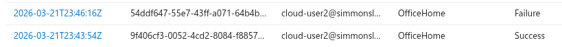
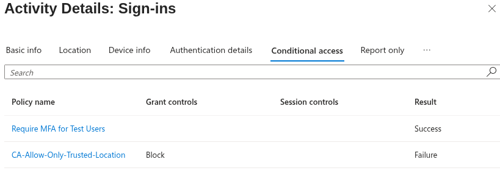
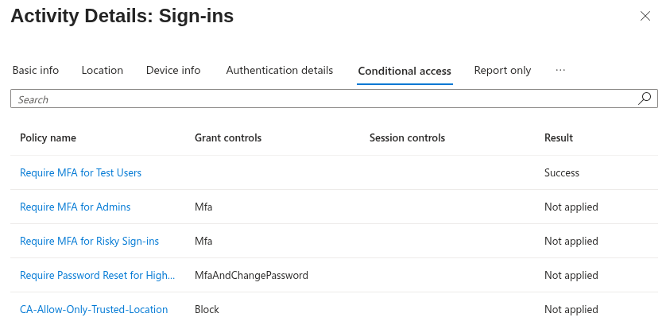

## 🧱 Phase 08.15 — Simulated Impossible Travel & Multi-Location Sign-in Analysis

### 🎯 Objective
Simulate and analyze multi-location sign-in behavior to identify potential identity anomalies.

---

### 🔧 Scenario

Two login attempts were performed for the same user within a short time window from different network locations:

- Home network (trusted)
- Cellular network (untrusted)

---

### 🔍 Observations

#### ✅ Login 1 — Trusted Network

- IP Address: 76.92.xxx.xxx
- Application: OfficeHome
- Status: Success

- Conditional Access:
  - Require MFA for Test Users → Success
  - Location policy → Not applied

---

#### ❌ Login 2 — Untrusted Network

- IP Address: 2600:1009:xxxx:xxxx:...
- Application: OfficeHome
- Status: Failure

- Conditional Access:
  - Require MFA for Test Users → Success
  - CA-Allow-Only-Trusted-Location → Failure (Block access)

---

### 🧠 Analysis

User authenticated successfully
↓
Second login originated from different network (mobile carrier)
↓
Conditional Access evaluated location
↓
Location not trusted
↓
Block access enforced
↓
User denied access

---

### 📸 Screenshots

---

### 🧠 Key Learning

Multiple sign-in attempts from different IP ranges in a short time window can indicate suspicious behavior such as impossible travel or credential misuse.

---

### 🔥 Real-World Insight

Even without premium risk detection, identity anomalies can be identified manually by analyzing sign-in logs, IP differences, and Conditional Access results.

Sensitive information such as IP addresses should be masked when documenting or sharing logs to follow security best practices.
