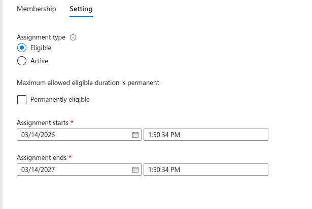
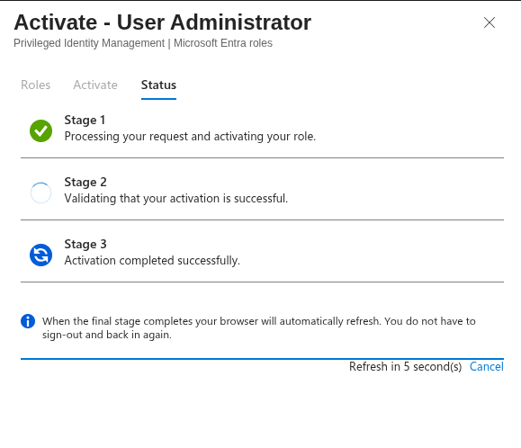
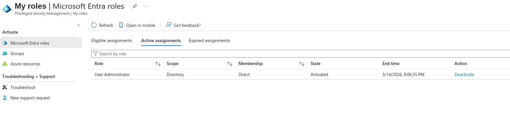

# 08.5 — Privileged Identity Management (PIM)

## Objective

Implement **Just-In-Time (JIT) administrative access** using Privileged Identity Management (PIM) in Microsoft Entra ID.

Instead of assigning permanent administrator privileges, users receive **eligible roles** and must activate them temporarily when administrative access is required.

This reduces the attack surface of privileged accounts and aligns with **Zero Trust identity security principles**.

---

# Environment

Tenant:

simmonslab.onmicrosoft.com

Identity platform:

Microsoft Entra ID

Administrative role used in this lab:

User Administrator

Test account:

cloud-admin@simmonslab.onmicrosoft.com

---

# Background

Permanent administrative privileges are a major security risk.

Attackers frequently target privileged identities because they allow full control of the identity infrastructure.

Privileged Identity Management mitigates this risk by implementing:

Just-In-Time administration

Instead of permanent admin access:

User
│
Permanent admin role
│
Unlimited privilege

PIM introduces **eligible roles**:

User
│
Eligible role assignment
│
User requests activation
│
MFA verification
│
Temporary privilege
│
Role expires automatically

This significantly reduces the risk of:

- Privileged account compromise
- Persistent attacker access
- Unauthorized administrative actions

---

# Step 1 — Create Eligible Role Assignment

Navigate to:

Microsoft Entra ID
→ Privileged Identity Management
→ Microsoft Entra roles
→ Roles
→ User Administrator
→ Add assignments

Configure the assignment:

Assignment type: Eligible
User: Cloud Admin

Optional configuration:

Permanently eligible: Enabled

This allows the user to activate the role when necessary.

---

## Screenshot — Eligible Assignment Configuration

---

# Step 2 — Activate the Role

Log in as the assigned user:

cloud-admin@simmonslab.onmicrosoft.com

Navigate to:

Microsoft Entra ID
→ Privileged Identity Management
→ My roles
→ Microsoft Entra roles

Select the eligible role:

User Administrator

Click:

Activate

Provide activation details:

Reason for activation
Activation duration

---

## Screenshot — Role Activation Process

---

# Step 3 — Verify Active Role

After activation is complete, the role appears under:

Active assignments

The role remains active until the configured expiration time.

---

## Screenshot — Active Role Assignment

---

# Authentication and Elevation Flow

The administrative workflow now follows this security model:

cloud-admin login
│
▼
Microsoft Entra ID authentication
│
Privileged Identity Management
│
Role activation request
│
MFA verification
│
Temporary administrative privilege
│
Role expires automatically

---

# Security Impact

Privileged Identity Management protects administrative roles against:

- Persistent admin access
- Credential theft
- Privilege escalation attacks
- Long-term attacker persistence

By enforcing **Just-In-Time elevation**, privileged access becomes temporary and auditable.

---

# Phase Progress

Completed phases:

08.1 Tenant Setup
08.2 Users and Groups
08.3 Enterprise Application Setup
08.4 Conditional Access (Require MFA for Admins)
08.5 Privileged Identity Management

Next phase:

08.6 Microsoft Entra Identity Protection

---

# Lab Architecture

Current identity architecture:

Active Directory (corp.local)
│
│ Hybrid Identity (future phase)
▼
Microsoft Entra ID
Tenant: simmonslab.onmicrosoft.com
│
├ Users
│ ├ cloud-admin
│ ├ cloud-user1
│ └ cloud-user2
│
├ Groups
│ ├ Cloud-Admins
│ └ Cloud-Users
│
├ Conditional Access
│ └ Require MFA for Admins
│
└ Privileged Identity Management
└ Just-In-Time Administrator Access

---

# Result

The lab environment now demonstrates:

- Identity lifecycle management
- Conditional Access security policies
- Privileged Identity Management
- Just-In-Time administrative access

These controls are commonly used in enterprise Microsoft Entra ID deployments and align with **Zero Trust identity architecture**.
