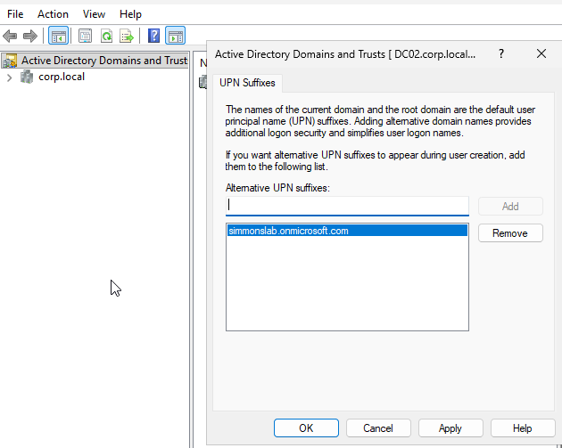
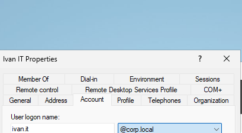
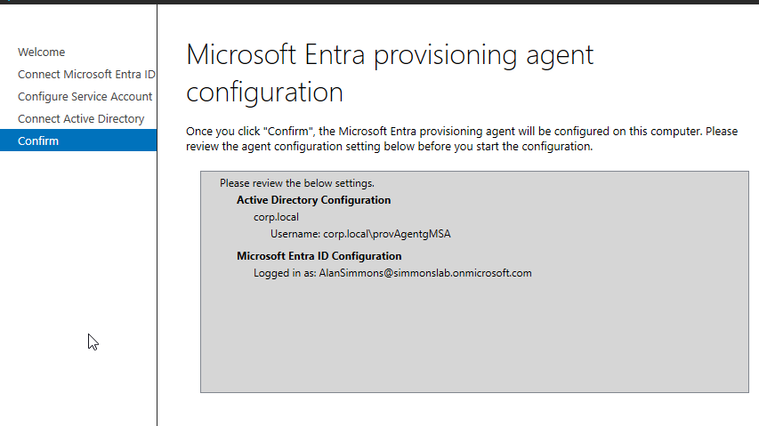
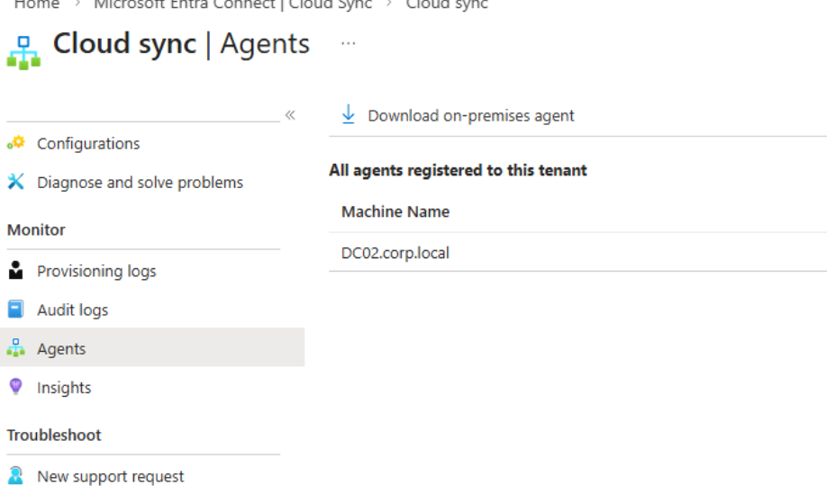
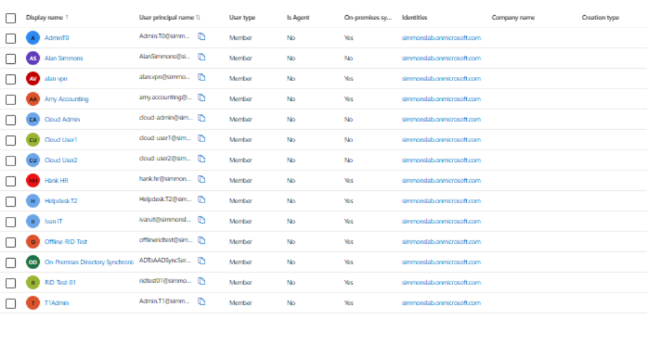
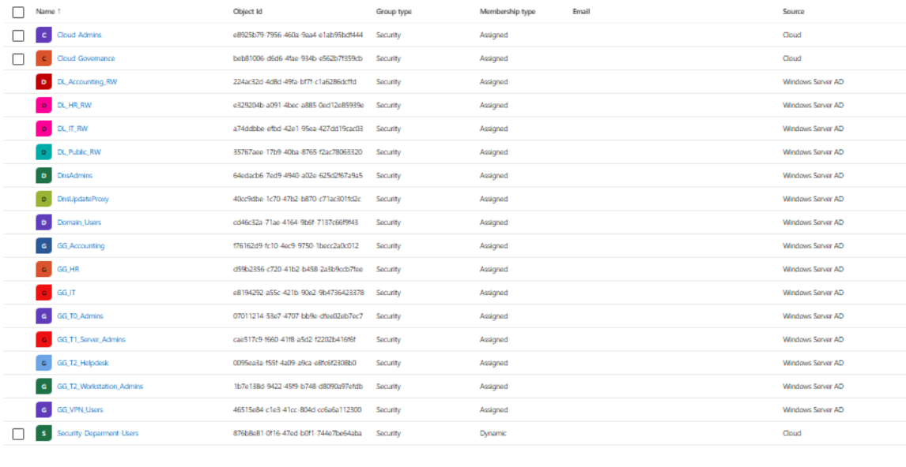

## 🧱 Phase 09 — Hybrid Identity with Microsoft Entra Cloud Sync

### 🎯 Objective
Implement hybrid identity by synchronizing on-prem Active Directory (corp.local) with Microsoft Entra ID using Cloud Sync.

---

### 🔧 Architecture Overview

On-Prem AD (corp.local)
↓
Microsoft Entra Provisioning Agent (DC02)
↓
Microsoft Entra ID (simmonslab.onmicrosoft.com)

---

### 🧱 Step 1 — Prepare User Principal Name (UPN)

Default AD UPN suffix:

@corp.local

This is NOT a valid cloud login domain.

---

### 🧠 Solution

Added a cloud-compatible UPN suffix:

simmonslab.onmicrosoft.com

---

### 📸 Screenshot — UPN Suffix Added

---

### 🧱 Step 2 — Update User UPN

Updated test user:

ivan.it@corp.local

→
ivan.it@simmonslab.onmicrosoft.com

---

### 📸 Screenshot — User UPN Update

---

### 🧱 Step 3 — Install Entra Provisioning Agent

Installed agent on:

DC02.corp.local

---

### 📸 Screenshot — Agent Configuration

---

### 🧠 Configuration Details

- Domain: corp.local
- Service Account: gMSA (auto-managed)
- Entra Tenant: simmonslab.onmicrosoft.com

---

### 🧱 Step 4 — Connect Active Directory

Linked provisioning agent to on-prem domain:

corp.local

---

### 📸 Screenshot — Connect Active Directory

---

### 🧱 Step 5 — Create Cloud Sync Configuration

In Entra:

Entra → Cloud Sync → New Configuration

Selected:

Active Directory → Microsoft Entra ID sync

---

### ⚠️ Initial Issue Encountered

- Domain not visible in dropdown
- Sync status = Disabled
- No users syncing

---

### 🧠 Root Cause

Agent was not fully recognized by Entra (delay / refresh issue)

---

### 🔧 Resolution

- Reconfigured agent connection to AD
- Refreshed Entra portal
- Enabled sync manually

---

### 🧱 Step 6 — Enable Sync

Changed:

Status: Disabled → Enabled

---

### 📸 Screenshot — Sync Agent Detected

---

### 🧱 Step 7 — Verify User Sync

All on-prem users successfully synchronized to Entra.

---

### 📸 Screenshot — Synced Users

---

### 📸 Screenshot — Synced Groups

---

### 🧠 Key Learning

Hybrid identity requires:

- UPN alignment between AD and Entra
- Proper agent configuration
- Sync activation (not automatic)
- Time for Entra to recognize agents

---

### 🔥 Real-World Insight

Synchronization does not occur instantly and may require:

- Manual enablement
- Agent reconfiguration
- Portal refresh delays

This reflects real-world troubleshooting scenarios in enterprise environments.

---

### 💡 Outcome

Successfully built a hybrid identity environment where:

- AD is the source of truth
- Users and groups sync to Entra
- Identities can now be used for cloud authentication

---

### 🚀 Next Steps

- Test hybrid login (synced user authentication)
- Enable Seamless SSO
- Introduce device-based Conditional Access (Intune) 

---
