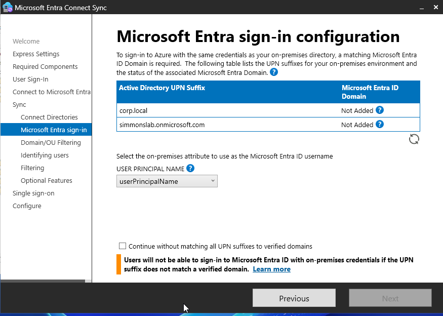
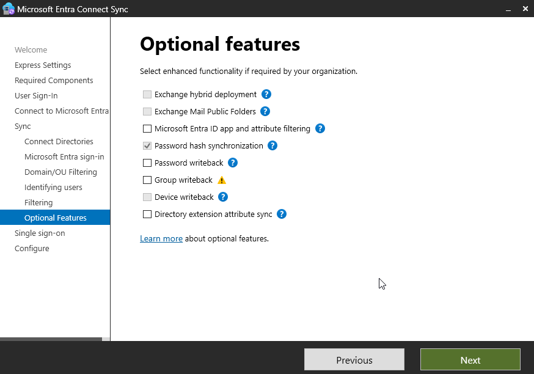
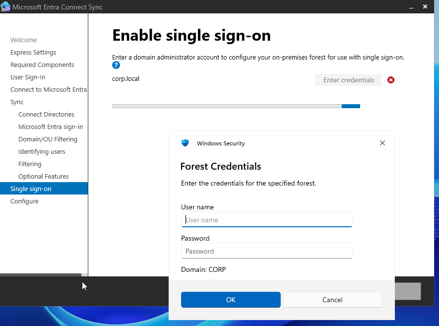
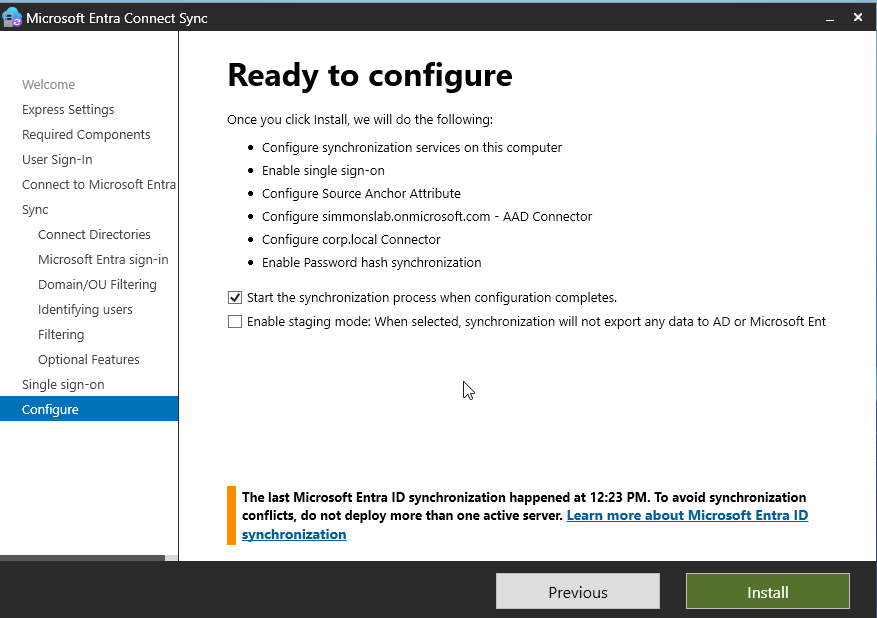
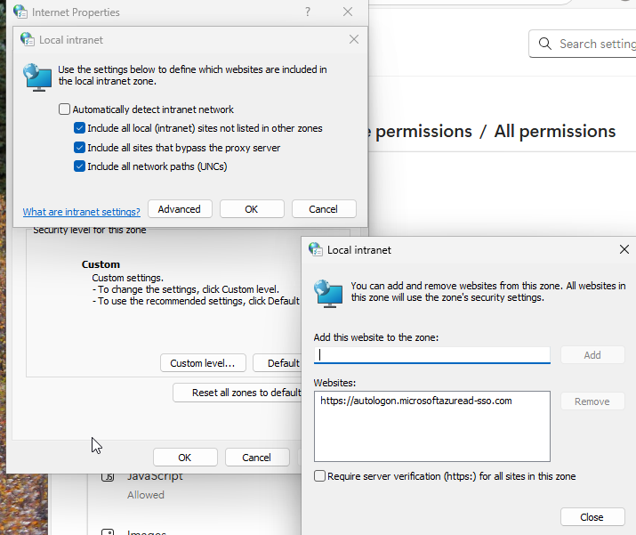
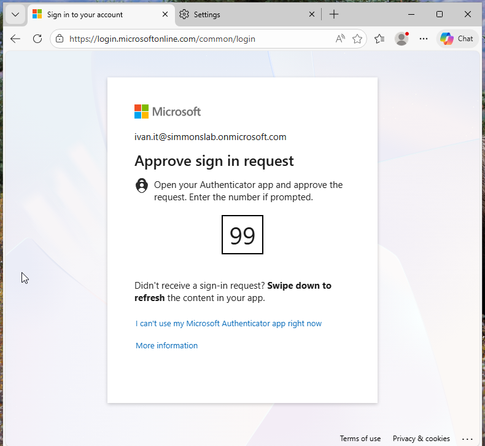

## 🧱 Phase 10 — Hybrid Authentication with Seamless SSO (Azure AD Connect)

### 🎯 Objective
Implement Azure AD Connect with Seamless Single Sign-On (SSO) to enable domain-joined users to access Microsoft Entra-integrated applications without entering their password.

---

## 🔧 Scenario

Previously, the lab used **Cloud Sync**, which does NOT support Seamless SSO.

To enable enterprise-grade authentication:

- Migrated from Cloud Sync → Azure AD Connect  
- Enabled Password Hash Sync  
- Enabled Seamless SSO  

---

## 🧪 Step 1 — Install Azure AD Connect

Selected **Customize** instead of Express to enable SSO configuration.

### 📸 Screenshot — Required Components


---

## 🧪 Step 2 — Configure User Sign-In

Selected:

- Password Hash Synchronization  
- Enabled Single Sign-On  

### 📸 Screenshot — User Sign-In Configuration


---

## 🧪 Step 3 — Connect Active Directory

Attempted to connect AD but encountered an error:

### 📸 Screenshot — Enterprise Admin Error


---

### 🧠 Issue

User was not part of:


Enterprise Admins


---

### 🧪 Fix

Added admin account to:


Enterprise Admins group


### 📸 Screenshot — Adding Enterprise Admin


---

## 🧪 Step 4 — DNS / Connectivity Issue

Encountered error:

### 📸 Screenshot — DNS Error


---


### 🧠 Cause

DC01 was offline.

---

### 🧪 Fix

- Powered on DC01
- Verified DNS connectivity

---

## 🧪 Step 5 — UPN Configuration

UPN suffixes were not matched.

### 📸 Screenshot — UPN Configuration



### 🧠 Decision

- Ignored `corp.local` (internal domain)
- Used `simmonslab.onmicrosoft.com` for login

✔ Selected:

`Continue without matching all UPN suffixes`

---

## 🧪 Step 6 — Optional Features

Left all options unchecked for simplicity.

### 📸 Screenshot — Optional Features



---

## 🧪 Step 7 — Enable Seamless SSO

Provided domain credentials to enable SSO.

### 📸 Screenshot — SSO Configuration



---

## 🧪 Step 8 — Ready to Configure

Confirmed installation and enabled sync.

### 📸 Screenshot — Ready to Configure



---

## 🧪 Step 9 — Configure Browser for SSO

Added the SSO endpoint to the Local Intranet zone:

`https://autologon.microsoftazuread-sso.com`

### 📸 Screenshot — Browser Configuration



---

## 🧪 Step 10 — Test SSO

Logged in from a domain-joined machine.

### 📸 Screenshot — MFA Prompt (SSO Working)



---

### 🧠 Observed Behavior

Login flow:

```text
Open portal.office.com
↓
Enter email only
↓
No password prompt
↓
MFA challenge
↓
Access granted
