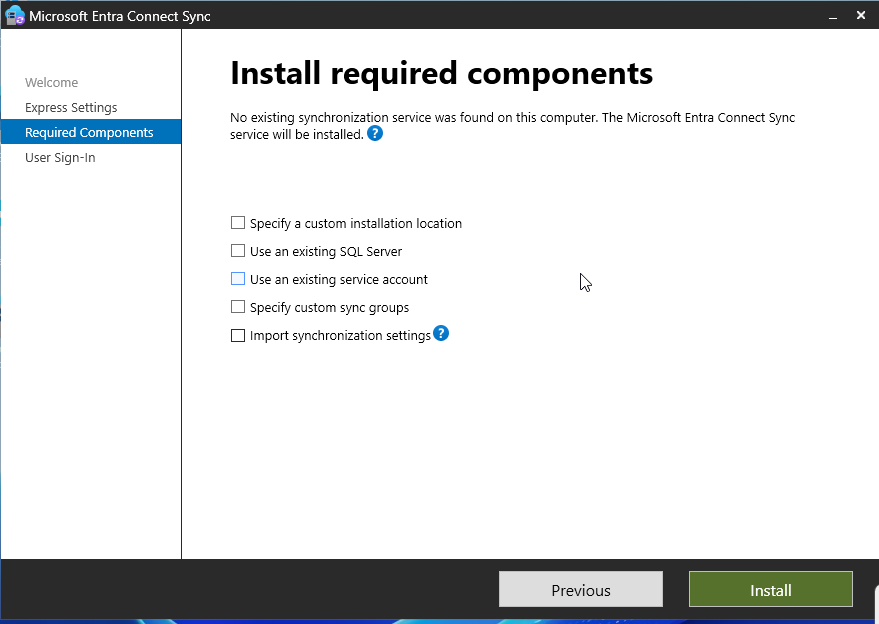
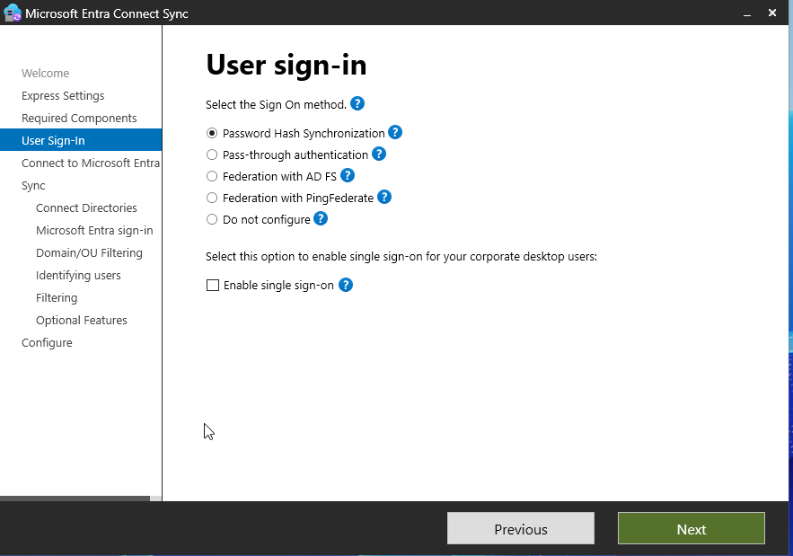
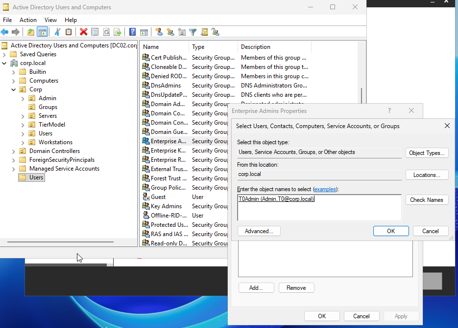
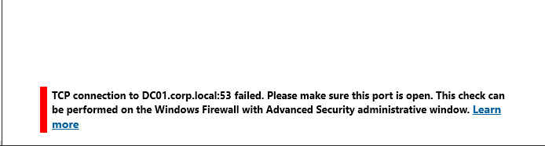

## 🧱 Phase 10 — Hybrid Authentication with Seamless SSO (Azure AD Connect)

### 🎯 Objective
Implement Azure AD Connect with Seamless Single Sign-On (SSO) to enable domain-joined users to access Microsoft Entra-integrated applications without entering their password.

---

## 🔧 Scenario

Previously, the lab used **Cloud Sync**, which does NOT support Seamless SSO.

To enable enterprise-grade authentication:

- Migrated from Cloud Sync → Azure AD Connect  
- Enabled Password Hash Sync  
- Enabled Seamless SSO  

---

## 🧪 Step 1 — Install Azure AD Connect

Selected **Customize** instead of Express to enable SSO configuration.

### 📸 Screenshot — Required Components

---

## 🧪 Step 2 — Configure User Sign-In

Selected:

- Password Hash Synchronization  
- Enabled Single Sign-On  

### 📸 Screenshot — User Sign-In Configuration

---

## 🧪 Step 3 — Connect Active Directory

Attempted to connect AD but encountered an error:

### 📸 Screenshot — Enterprise Admin Error

---

### 🧠 Issue

User was not part of:

Enterprise Admins

---

### 🧪 Fix

Added admin account to:

Enterprise Admins group

### 📸 Screenshot — Adding Enterprise Admin

---

## 🧪 Step 4 — DNS / Connectivity Issue

Encountered error:

### 📸 Screenshot — DNS Error

---

### 🧠 Cause

DC01 was offline
## 🧪 Fix
Powered on DC01
Verified DNS connectivity

## 🧪 Step 5 — UPN Configuration

UPN suffixes were not matched:

# 📸 Screenshot — UPN Configuration

# 🧠 Decision
Ignored corp.local (internal domain)
Used simmonslab.onmicrosoft.com for login

✔ Selected:

Continue without matching all UPN suffixes

## 🧪 Step 6 — Optional Features

Left all options unchecked for simplicity.

# 📸 Screenshot — Optional Features

## 🧪 Step 7 — Enable Seamless SSO

Provided domain credentials to enable SSO.

# 📸 Screenshot — SSO Configuration

##  🧪 Step 8 — Ready to Configure

Confirmed installation and enabled sync.

# 📸 Screenshot — Ready to Configure

## 🧪 Step 9 — Configure Browser for SSO

Added SSO endpoint to Local Intranet zone:

https://autologon.microsoftazuread-sso.com
# 📸 Screenshot — Browser Configuration

## 🧪 Step 10 — Test SSO

Logged in from domain-joined machine:

# 📸 Screenshot — MFA Prompt (SSO Working)

# 🧠 Observed Behavior
Login flow:
Open portal.office.com
↓
Enter email ONLY
↓
NO password prompt
↓
MFA challenge
↓
Access granted

# 🔥 Key Result

✔ Passwordless SSO achieved (no password prompt)
✔ Kerberos authentication working
✔ Conditional Access (MFA) enforced
✔ Hybrid identity fully functional

# 🧠 Key Learning

Seamless SSO works by:

Domain login → Kerberos ticket → Entra trust → SSO

Important distinction:

SSO removes password
MFA is still required (by policy)
# 🔥 Real-World Insight

This setup reflects enterprise authentication design:

On-prem AD for identity
Entra ID for cloud access
Kerberos for seamless authentication
Conditional Access for security

# 💡 Outcome

Successfully implemented:

Azure AD Connect
Password Hash Sync
Seamless SSO
Hybrid authentication flow

#### 🚀 Next Steps
Device-based access (Intune)
Conditional Access (device compliance)
Passwordless enforcement (FIDO2 / Authenticator)
