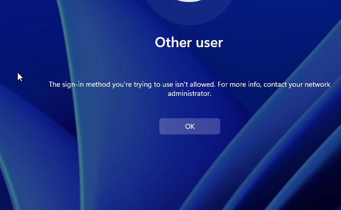
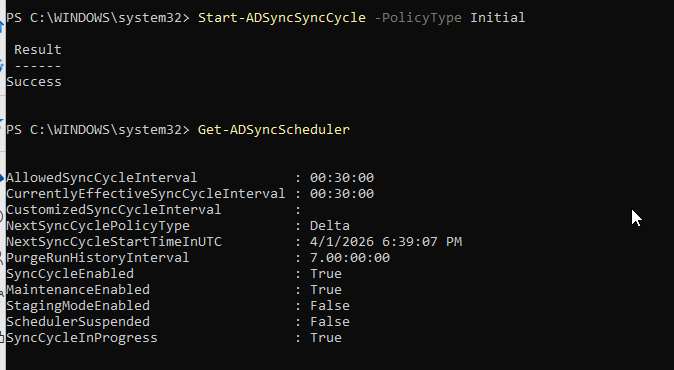

# 🧪 Phase 13 — Tier 0 Identity Architecture Redesign (Dedicated Entra Sync Server)

## 🎯 Objective

Redesign the hybrid identity architecture by migrating Microsoft Entra Connect from a Domain Controller to a dedicated sync server, aligning with Tier 0 security best practices.

---

## 🧱 Background

Initial hybrid identity setup placed Entra Connect on a Domain Controller (DC02):

* AD DS
* DNS
* Entra Connect ❌

While functional, this introduces risk:

* Increased attack surface
* Mixed roles on Tier 0 systems
* Poor alignment with enterprise security design

---

## 🧠 Design Decision

Move identity synchronization to a dedicated server:

### ✅ New Architecture

* **DC01 / DC02**

  * AD DS
  * DNS

* **SYNC01**

  * Microsoft Entra Connect ✔
  * Domain joined
  * Dedicated role

---

## 🛠️ Implementation

### 1. Create SYNC01

* Windows Server 2022
* Domain joined (`corp.local`)
* Static IP configured


---

### 2. Install Microsoft Entra Connect

* Downloaded installer
* Used **custom setup**
* Enabled:

  * Password Hash Sync
  * Hybrid Azure AD Join
  * OU filtering

---

### 3. Initial Issue — Installer Blocked

Server hardening policies prevented installation:


👉 Resolution:

* Temporarily removed SYNC01 from hardened OU
* Allowed installation
* Plan to re-secure later

---

### 4. GPO Lockout Issue

After applying security policies:



👉 Cause:

* Misconfigured **User Rights Assignment**
* `Deny log on locally` included Domain Users

👉 Resolution:

* Reset local policy using `secedit`
* Rebuilt GPO safely

---

### 5. Verify AD Structure

User created in AD:


---

### 6. Sync Validation

Confirmed user synced to Entra ID:


---

### 7. Sync Service Verification

```powershell
Get-Service ADSync
```


---

### 8. Sync Scheduler Verification

```powershell
Get-ADSyncScheduler
```


---

### 9. Hybrid Join Validation

```powershell
dsregcmd /status
```


✔ AzureAdJoined : YES
✔ DeviceAuthStatus : SUCCESS

---

### 10. Decommission DC02 Sync Role

Enabled staging mode on DC02:



👉 Ensures:

* No duplicate sync
* SYNC01 is authoritative

---

## 🧪 Issues Encountered

* Installer blocked by security policy
* GPO lockout (User Rights Assignment)
* Policy persistence (“tattooing”)
* Sync service access troubleshooting

---

## 🔧 Troubleshooting Performed

* Used `secedit` to reset local security policy
* Analyzed `gpresult` and RSOP
* Validated service status (`Get-Service ADSync`)
* Forced sync cycles (`Start-ADSyncSyncCycle`)
* Verified device join state (`dsregcmd`)

---

## ✅ Final State

✔ Dedicated sync server (SYNC01)
✔ DC02 in staging mode
✔ Successful user sync
✔ Hybrid join validated
✔ Clean separation of roles

---

## 🧠 Key Takeaways

* Domain Controllers should remain minimal (Tier 0)
* Identity sync is a critical security boundary
* GPO misconfigurations can cause lockouts
* Security policies may persist locally (tattooing)
* Always validate end-to-end identity flow

---

## 🔥 Real-World Insight

Shift from:

❌ “Make it work”

➡️

✅ “Make it secure and scalable”

---

## 🏆 Outcome

Built:

* Secure hybrid identity architecture ✔
* Dedicated sync infrastructure ✔
* Validated identity pipeline ✔
* Real-world troubleshooting experience ✔

